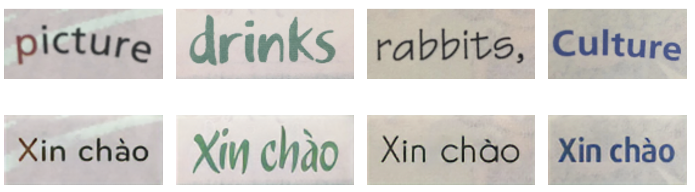

# Text Replacement | SRNet

## Introduction
SRNet is aimed at modifying text in a source image but still keeps the font, color styles of the origin text. This repository is a modified version of [Niwhskal](https://github.com/Niwhskal/SRNet) repository, which implements the paper [Editing Text in the wild](https://arxiv.org/abs/1908.03047) by Liang Wu, Chengquan Zhang

The model was finetuned for Vietnamese text.


## Installation

1. Clone this repository:
    ```bash
    $ git clone https://github.com/Niwhskal/SRNet.git

    $ cd SRNet
    ```
2. Install requirements (Python 3):
    ```bash
    $ pip install -r requirements.txt
    ```

### Data setup

This repository provides you with a bash script that circumvents the process of synthesizing the data manually as the original implementation does. The default [configuration parameters](https://github.com/Niwhskal/SRNet/blob/582749370e356cb32396152f6078e1150b91212e/SRNet-Datagen/Synthtext/data_cfg.py#L10) set's up a dataset that is sufficient to train a robust model.

- Grant execute permission to the bash script:
    ```bash
    $ chmod +x data_script.sh
    ```
- Setup training data by executing:
    ```bash
    $ ./data_script.sh
    ```

### Training

1. Modifying the cfg.py script to change the paths accordingly.  
2. Run the train.py script to start training
    ```bash
    $ python3 train.py
    ```

### Prediction

In order to predict, you will need to provide a pair of inputs (The source *i_s* and the custom text rendered on a plain background in grayscale (i_t) -examples can be found in `SRNet/custom_feed/labels`-). Place all such pairs in a folder.  

- Inference can be carried out by running:
    ```bash
    $ python3 predict.py --input_dir *data_dir* --save_dir *destination_dir* --checkpoint *path_to_ckpt*
    ```

### Pre-trained weights

I finetuned the model using Google Colab Free and the original pretrained model (you can get the original weights on Niwhskal's repository) or download my pre-trained weights [here](https://drive.google.com/file/d/1FMyabJ5ivT3HVUfUeozqOpMqlU68V65K/view?usp=sharing)
My training result

  




## References

* [Editing Text in the Wild](https://arxiv.org/abs/1908.03047): An innovative idea of using GAN's in an unorthodox manner. 

* [Niwhskal](https://github.com/youdao-ai/SRNet): The original Pytorch implementation 

* [SynthText project](https://github.com/ankush-me/SynthText): This work provides the background dataset that is instrumental for data synthesis.

